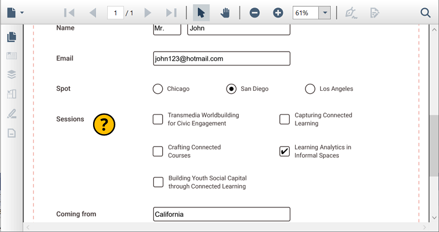

# Viewing Password protected PDF Files in WPF Pdf Viewer

PDF Viewer allows you to view the password-protected PDF files by passing the file name and the correct password as parameters to the [Load](https://help.syncfusion.com/cr/wpf/Syncfusion.Windows.PdfViewer.PdfViewerControl.html#Syncfusion_Windows_PdfViewer_PdfViewerControl_Load_System_String_System_String_) method of [PdfViewerControl](https://help.syncfusion.com/cr/wpf/Syncfusion.Windows.PdfViewer.PdfViewerControl.html#Syncfusion_Windows_PdfViewer_PdfViewerControl_Load_System_String_System_String_). Refer to the following code to perform the same.



using System.Windows;

namespace PdfViewerDemo
{
    /// 

    /// Interaction logic for MainWindow.xaml
    /// 

    public partial class MainWindow : Window
    {
        # region Constructor
        public MainWindow()
        {
            InitializeComponent();

            //Load password protected PDF file using the file path and the password.
            pdfViewer.Load(@"Template.pdf", "password");
        }
        #endregion
    }
}



## View password protected PDF files in run time

When opening a password protected PDF file in run time using the Open button available in the toolbar, the following built-in password dialog window helps to to view the file contents, requesting the correct password from the user. In the password textbox, enter the correct password and click `OK`.

## Hide the built-in password dialog

PDF Viewer helps to hide the built-in password using the `GetDocumentPassword` and gets the password using the `Password` property of the `GetDocumentPasswordEventArgs`. The event `GetDocumentPassword` occurs every time when you try to open a password protected PDF file in run-time. By setting the `Handled` property of `GetDocumentPasswordEventArgs` to true, the built-in password dialog will not appear. Refer to the following code to hide the password dialog and to provide password to open the file by wiring the event.



using Syncfusion.Windows.PdfViewer;
using System.Collections.Generic;
using System.Windows;

namespace PasswordPDFDemo
{    
    public partial class MainWindow : Window
    {
        public MainWindow()
        {
            InitializeComponent();
            pdfViewerControl. GetDocumentPassword += PdfViewer_GetDocumentPassword;
            string filePath = Path.GetFullPath(@"../../Data/syncfusion.pdf");
            pdfViewerControl.Load(filePath);
        }

     private void PdfViewer_GetDocumentPassword(object sender, GetDocumentPasswordEventArgs e)
     {
            System.Security.SecureString secureString = new System.Security.SecureString();
            secureString.AppendChar('p');
            secureString.AppendChar('a');
            secureString.AppendChar('s');
            secureString.AppendChar('s');
            secureString.AppendChar('w');
            secureString.AppendChar('o');
            secureString.AppendChar('r');
            secureString.AppendChar('d');
            e.Password = secureString;
            
            // Enabling handled to hide the password dialog.
            e.Handled = true;            
        }
    }
}



## View password protected PDF with owner password

The PDF Viewer allows you to view password protected PDF with the owner password, and you can perform all the operations available in the PdfViewer. The image below is an example of opening the PDF with the owner password.

## View password protected PDF with user password

The PDF Viewer allows you to view password protected PDF with the user password, and operations are available depending upon PdfPermissionTags. The image below is an example of opening the PDF with user password and `default` permission tag.

The table below lists PdfPermissionTags and features restricted in PdfViewer.

<table>
<tr>
<th>PdfPermissionTags</th>
<th>Restrictions in PdfViewer</th>
</tr>
<tr>
<td>Default</td>
<td>
Content Copying 
Annotations 
Print 
Filling of form fields 
Redaction 
Page Organizer 
</td>
</tr>
<tr>
<td>AccessibilityCopyContent</td>
<td>
Content Copying 
Annotations 
Print 
Filling of form fields 
Redaction 
Page Organizer 
</td>
</tr>
<tr>
<td>CopyContent</td>
<td>
Annotations 
Print 
Filling of form fields 
Redaction 
Page Organizer 
</td>
</tr>
<tr>
<td>AssembleDocument</td>
<td>
Content Copying 
Annotations 
Print 
Filling of form fields 
Redaction 
</td>
</tr>
<tr>
<td>EditAnnotations</td>
<td>
Content Copying 
Print 
Page Organizer 
</td>
</tr>
<tr>
<td>Print</td>
<td>
Content Copying 
Annotations 
Filling of form fields 
Redaction 
Page Organizer 
</td>
</tr>
<tr>
<td>FullQualityPrint</td>
<td>
Content Copying 
Annotations 
Filling of form fields 
Redaction 
Page Organizer 
</td>
</tr>
<tr>
<td>FillFields</td>
<td>
Content Copying 
Annotations 
Print 
Redaction 
Page Organizer 
</td>
</tr>
<tr>
<td>EditContent</td>
<td>
Content Copying 
Annotations 
Print 
Redaction 
Page Organizer 
</td>
</tr>
</table>

N> You can refer to our [WPF PDF Viewer](https://www.syncfusion.com/wpf-controls/pdf-viewer) feature tour page for its groundbreaking feature representations. You can also explore our [WPF PDF Viewer example](https://github.com/syncfusion/wpf-demos) to know how to render and configure the pdfviewer.