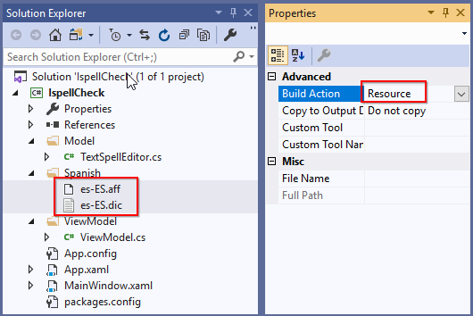
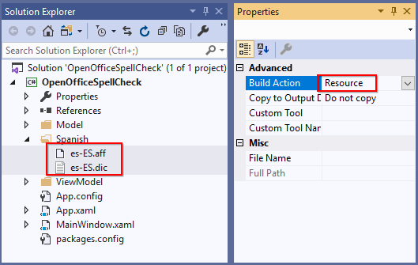

# Custom Dictionary in WPF SpellChecker (SfSpellChecker)

You can use a default and custom dictionaries to spell check the document based on your need. You can also spell check for any culture and languages using various dictionaries.

## Default SpellCheck Dictionary

[SfSpellChecker](https://help.syncfusion.com/cr/wpf/Syncfusion.Windows.Controls.SfSpellChecker.html) provides built-in dictionary for `English` language and it provides  suitable suggestion of the error words.

## Load your own dictionaries for any language

You can add your own dictionary to [SfSpellChecker.Dictionaries](https://help.syncfusion.com/cr/wpf/Syncfusion.Windows.Controls.SfSpellChecker.html#Syncfusion_Windows_Controls_SfSpellChecker_Dictionaries) collection. `SfSpellChecker` support 3 standard dictionary file format:

 * 1.Hunspell
 * 2.Ispell
 * 3.OpenOffice
 
N> Built-in dictionary will be disabled once custom dictionary is added to SfSpellChecker

## SpellCheck using Hunspell dictionary

You can check spelling mistakes using `Hunspell` dictionary format. This format contains files as follows,

* Affix file with grammar rules- `*.aff`, 
* Basic Words file - `*.dic` file.

### Adding Hunspell Dictionary

1. Add your [HunspellDictionary](https://help.syncfusion.com/cr/wpf/Syncfusion.Windows.Controls.HunspellDictionary.html)'s required culture `*.aff` and `*.dic` files and add them as `Resource` into the application.

2. Create a `HunspellDictionary` instance and add the basic word & grammar file path to the [HunspellDictionary.DictionaryUri](https://help.syncfusion.com/cr/wpf/Syncfusion.Windows.Controls.HunspellDictionary.html#Syncfusion_Windows_Controls_HunspellDictionary_DictionaryUri) & [HunspellDictionary.GrammarUri](https://help.syncfusion.com/cr/wpf/Syncfusion.Windows.Controls.HunspellDictionary.html#Syncfusion_Windows_Controls_HunspellDictionary_GrammarUri) properties and add the culture to the [HunspellDictionary.Culture](https://help.syncfusion.com/cr/wpf/Syncfusion.Windows.Controls.HunspellDictionary.html) property.

3. Add the  `HunspellDictionary` into the `SfSpellChecker.Dictionaries` collection

4. Setting the required culture to the [SfSpellChecker.Culture](https://help.syncfusion.com/cr/wpf/Syncfusion.Windows.Controls.SfSpellChecker.html#Syncfusion_Windows_Controls_SfSpellChecker_Culture) property.

N> The following code snippets shows how to add Hunspell dictionary to the `SpellChecker`. Please refer [Adding SfSpellChecker to an application](https://help.syncfusion.com/windowsforms/spell-checker/getting-started#adding-wpf-sfspellchecker-to-an-application) to know how to configure SfSpellChecker.





<Grid>
    <StackPanel>
        <TextBox 
            Text="Nous sommevs heureusre de vous avochir ici"
            Name="textbox"
            TextWrapping="Wrap">

            <!--Adding Spellchecker to the TextBox-->
            <syncfusion:SfSpellChecker.SpellChecker>
                <syncfusion:SfSpellChecker
                    Culture="fr-FR"
                    x:Name="spellChecker"
                    EnableSpellCheck="True">
                    <syncfusion:SfSpellChecker.Dictionaries>

                        <!--Adding French cultured Hunspell dictionary-->
                        <syncfusion:HunspellDictionary DictionaryUri="/HunSpellCheck;component/French/fr-FR.dic"
                                                       GrammarUri="/HunSpellCheck;component/French/fr-FR.aff"
                                                       Culture="fr-FR"/>
                    </syncfusion:SfSpellChecker.Dictionaries>
                </syncfusion:SfSpellChecker>
            </syncfusion:SfSpellChecker.SpellChecker>
        </TextBox>
        <Button 
            Content="Spell Check"
            Click="SpellCheck_ButtonClick"                
            HorizontalAlignment="Center"></Button>
    </StackPanel>
</Grid>




//Creating a culture instance
CultureInfo culture = new CultureInfo("fr-FR");

SfSpellChecker spellChecker = new SfSpellChecker();

// Adding Hunspell dictonaries in Dictionaries collection
spellChecker.Dictionaries = new DictionaryCollection();

//Add French culture Hunspell dictionary
spellChecker.Dictionaries.Add(
    new HunspellDictionary()
    {
        Culture = culture,
        GrammarUri = new Uri("/HunSpellCheck;component/French/fr-FR.aff", UriKind.Relative),
        DictionaryUri = new Uri("/HunSpellCheck;component/French/fr-FR.dic", UriKind.Relative)
    }
);

//Setting a French culture for SpellChecker
spellChecker.Culture = culture;

//Assigning a spellchecker to the TextBox
SfSpellChecker.SetSpellChecker(textbox, spellChecker);




{{ codesnippet1 | OrderList_Indent_Level_1 }}





//Call SpellCheck method to open SpellCheck on button click
private void SpellCheck_ButtonClick(object sender, RoutedEventArgs e) {
    spellChecker.PerformSpellCheckUsingDialog();
}




{{ codesnippet2 | OrderList_Indent_Level_2 }}

N> You can add multiple `HunspellDictionary` with various culture files into the `SfSpellChecker.Dictionaries` collection. Based on the `SfSpellChecker.Culture` respective `HunspellDictionary` is used for spell check.

## SpellCheck using Ispell dictionary

You can check spelling mistakes using `Ispell` dictionary format. This format contains files as follows,

`Ispell` dictionary contains two files as follows,

* Affix file with grammar rules- `*.aff`, 
* Basic Words file - `*.xlg` or `*.dic` file.

### Adding Ispell Dictionary

1. Add your [IspellDictionary](https://help.syncfusion.com/cr/wpf/Syncfusion.Windows.Controls.IspellDictionary.html)'s required culture `*.aff` and `*.dic` files and add them as `Resource` into the application.

2. Create a `IspellDictionary` instance and add the basic word & grammar file path to the [IspellDictionary.DictionaryUri](https://help.syncfusion.com/cr/wpf/Syncfusion.Windows.Controls.IspellDictionary.html#Syncfusion_Windows_Controls_IspellDictionary_DictionaryUri) & [IspellDictionary.GrammarUri](https://help.syncfusion.com/cr/wpf/Syncfusion.Windows.Controls.IspellDictionary.html#Syncfusion_Windows_Controls_IspellDictionary_GrammarUri) properties and add the culture to the [IspellDictionary.Culture](https://help.syncfusion.com/cr/wpf/Syncfusion.Windows.Controls.IspellDictionary.html) property.

3. Add the  `IspellDictionary` into the `SfSpellChecker.Dictionaries` collection

4. Setting the required culture to the `SfSpellChecker.Culture` property.





<Grid>
    <StackPanel>
        <TextBox 
            Text="gracsq por venizr por favor ven de nuevoq"
            Name="textbox"
            TextWrapping="Wrap">

            <!--Adding Spellchecker to the TextBox-->
            <syncfusion:SfSpellChecker.SpellChecker>
                <syncfusion:SfSpellChecker
                    Culture="es-ES"
                    x:Name="spellChecker"
                    EnableSpellCheck="True">
                    <syncfusion:SfSpellChecker.Dictionaries>

                        <!--Adding Spanish cultured Ispell dictionary-->
                        <syncfusion:IspellDictionary DictionaryUri="/IspellCheck;component/Spanish/es-ES.dic"
                                                     GrammarUri="/IspellCheck;component/Spanish/es-ES.aff"
                                                     Culture="es-ES"/>
                    </syncfusion:SfSpellChecker.Dictionaries>
                </syncfusion:SfSpellChecker>
            </syncfusion:SfSpellChecker.SpellChecker>
        </TextBox>
        <Button 
            Content="Spell Check"
            Click="SpellCheck_ButtonClick"                
            HorizontalAlignment="Center"></Button>
    </StackPanel>
</Grid>




//Creating a culture instance
CultureInfo culture = new CultureInfo("es-ES");

SfSpellChecker spellChecker = new SfSpellChecker();

// Adding Ispell dictonaries in Dictionaries collection
spellChecker.Dictionaries = new DictionaryCollection();

//Add Spanish culture Ispell dictionary
spellChecker.Dictionaries.Add(
    new IspellDictionary()
    {
        Culture = culture,
        GrammarUri = new Uri("/IspellCheck;component/Spanish/es-ES.aff", UriKind.Relative),
        DictionaryUri = new Uri("/IspellCheck;component/Spanish/es-ES.dic", UriKind.Relative)
    }
);

//Setting a Spanish culture for SpellChecker
spellChecker.Culture = culture;

//Assigning a spellchecker to the TextBox
SfSpellChecker.SetSpellChecker(textbox, spellChecker);




{{ codesnippet3 | OrderList_Indent_Level_1 }}





//Call SpellCheck method to open SpellCheck on button click
private void SpellCheck_ButtonClick(object sender, RoutedEventArgs e) {
    spellChecker.PerformSpellCheckUsingDialog();
}




{{ codesnippet4 | OrderList_Indent_Level_2 }}

N> You can add multiple `IspellDictionary` with various culture files into the `SfSpellChecker.Dictionaries` collection. Based on the `SfSpellChecker.Culture` respective `IspellDictionary` is used for spell check.

## SpellCheck using OpenOffice dictionary

You can check spelling mistakes using `OpenOffice` dictionary format. This format contains files as follows,

`OpenOffice` dictionary contains two files as follows,

* Affix file with grammar rules- `*.aff`, 
* Basic Words file - `*.dic` file.

### Adding OpenOffice Dictionary

1. Add your [OpenOfficeDictionary](https://help.syncfusion.com/cr/wpf/Syncfusion.Windows.Controls.OpenOfficeDictionary.html)'s required culture `*.aff` and `*.dic` files and add them as `Resource` into the application.

2. Create a `OpenOfficeDictionary` instance and add the basic word & grammar file path to the [OpenOfficeDictionary.DictionaryUri](https://help.syncfusion.com/cr/wpf/Syncfusion.Windows.Controls.OpenOfficeDictionary.html) & [OpenOfficeDictionary.GrammarUri](https://help.syncfusion.com/cr/wpf/Syncfusion.Windows.Controls.OpenOfficeDictionary.html) properties and add the culture to the [OpenOfficeDictionary.Culture](https://help.syncfusion.com/cr/wpf/Syncfusion.Windows.Controls.OpenOfficeDictionary.html) property.

3. Add the  `OpenOfficeDictionary` into the `SfSpellChecker.Dictionaries` collection

4. Setting the required culture to the `SfSpellChecker.Culture` property.





<Grid>
    <StackPanel>
        <TextBox 
            Text="gracsq por venizr por favor ven de nuevoq"
            Name="textbox"
            TextWrapping="Wrap">

            <!--Adding Spellchecker to the TextBox-->
            <syncfusion:SfSpellChecker.SpellChecker>
                <syncfusion:SfSpellChecker
                    Culture="es-ES"
                    x:Name="spellChecker"
                    EnableSpellCheck="True">
                    <syncfusion:SfSpellChecker.Dictionaries>

                        <!--Adding Spanish cultured OpenOffice dictionary-->
                        <syncfusion:OpenOfficeDictionary DictionaryUri="/OpenOfficeSpellCheck;component/Spanish/es-ES.dic"
                                                         GrammarUri="/OpenOfficeSpellCheck;component/Spanish/es-ES.aff"
                                                         Culture="es-ES"/>
                    </syncfusion:SfSpellChecker.Dictionaries>
                </syncfusion:SfSpellChecker>
            </syncfusion:SfSpellChecker.SpellChecker>
        </TextBox>
        <Button 
            Content="Spell Check"
            Click="SpellCheck_ButtonClick"                
            HorizontalAlignment="Center"></Button>
    </StackPanel>
</Grid>




//Creating a Spanish culture instance
CultureInfo culture = new CultureInfo("es-ES");

SfSpellChecker spellChecker = new SfSpellChecker();

// Adding OpenOffice dictonaries in Dictionaries collection
spellChecker.Dictionaries = new DictionaryCollection();

//Add Spanish culture OpenOffice dictionary
spellChecker.Dictionaries.Add(
    new OpenOfficeDictionary()
    {
        Culture = culture,
        GrammarUri = new Uri("/OpenOfficeSpellCheck;component/Spanish/es-ES.aff", UriKind.Relative),
        DictionaryUri = new Uri("/OpenOfficeSpellCheck;component/Spanish/es-ES.dic", UriKind.Relative)
    }
);

//Setting a Spanish culture for SpellChecker
spellChecker.Culture = culture;

//Assigning a spellchecker to the TextBox
SfSpellChecker.SetSpellChecker(textbox, spellChecker);




{{ codesnippet5 | OrderList_Indent_Level_1 }}





//Call SpellCheck method to open SpellCheck on button click
private void SpellCheck_ButtonClick(object sender, RoutedEventArgs e) {
    spellChecker.PerformSpellCheckUsingDialog();
}




{{ codesnippet6 | OrderList_Indent_Level_2 }}

N> You can add multiple `OpenOfficeDictionary` with various culture files into the `SfSpellChecker.Dictionaries` collection. Based on the `SfSpellChecker.Culture` respective `OpenOfficeDictionary` is used for spell check.

## Add custom words to dictionary

If you want to add words that is not available in existing  dictionary, you can add it using [CustomDictionary](https://help.syncfusion.com/cr/wpf/Syncfusion.Windows.Controls.CustomDictionary.html). This dictionary does not has a grammar file, it accepts only dictionary file that contains a list of words. Users can also add words to this custom dictionary by clicking `Add to Dictionary` button available in dialog or context menu. 

You can add multiple `CustomDictionary` for each culture using `SfSpellChecker.Dictionaries` collection. If you load the `SfSpellChecker` with `en-US` culture, then you can add your custom words only on `en-US` cultured `CustomDictionary`.  

### Adding Custom Dictionary

1. Create a custom dictionary text file, set build action as `None` and set `Copy to Output Directory` to `Copy if newer`. 

2. Create a `CustomDictionary` instance and add the custom word file path to the [CustomDictionary.DictionaryUri](https://help.syncfusion.com/cr/wpf/Syncfusion.Windows.Controls.CustomDictionary.html#Syncfusion_Windows_Controls_CustomDictionary_DictionaryUri) property and add the culture to the [CustomDictionary.Culture](https://help.syncfusion.com/cr/wpf/Syncfusion.Windows.Controls.CustomDictionary.html) property.

3. Add the  `CustomDictionary` into the `SfSpellChecker.Dictionaries` collection

4. Setting the required culture to the `SfSpellChecker.Culture` property.





<Grid>
    <StackPanel>
        <TextBox 
            Text="Ribbn illustrats the Microsoft illustrats Offce 2007 UI. Our prduct exposes most of the featres of the new UI and eeps intact winhth the Slverlight architecture. Configuring and designing the layout is very easy through XAML code. Ribbon tabs and Ribbon bars are the main client area in Ribbon. Ribbon tabs will allow your end users to navigate and find the appropriate tools for the task at hand. The Ribbon bars will contain the Ribbon tools."
            Name="textbox"
            TextWrapping="Wrap">

            <!--Adding Spellchecker to the TextBox-->
            <syncfusion:SfSpellChecker.SpellChecker>
                <syncfusion:SfSpellChecker
                    Culture="en-US"
                    x:Name="spellChecker"
                    EnableSpellCheck="True">
                    <syncfusion:SfSpellChecker.Dictionaries>

                        <!--Adding english cultured custom dictionary-->
                        <syncfusion:CustomDictionary DictionaryUri="E:/SpellcheckerDemo/bin/Debug/English/Custom_en-US.txt"
                                                     Culture="en-US"/>

                        <!--Adding english cultured OpenOffice dictionary-->
                        <syncfusion:OpenOfficeDictionary DictionaryUri="/CustomSpellCheck;component/US/en-US.dic"
                                                         GrammarUri="/CustomSpellCheck;component/US/en-US.aff"
                                                         Culture="en-US"/>
                        
                    </syncfusion:SfSpellChecker.Dictionaries>
                </syncfusion:SfSpellChecker>
            </syncfusion:SfSpellChecker.SpellChecker>
        </TextBox>
        <Button 
            Content="Spell Check"
            Click="SpellCheck_ButtonClick"                
            HorizontalAlignment="Center"></Button>
    </StackPanel>
</Grid>




//Creating a culture instance
CultureInfo culture = new CultureInfo("en-US");

SfSpellChecker spellChecker = new SfSpellChecker();

// Get the current PROJECT directory
Uri CustomDict_uri= new Uri(Directory.GetCurrentDirectory()+  

                            @"\English\Custom_en-US.txt", UriKind.Absolute); 

//Add Custom dictionary for US culture
spellChecker.Dictionaries.Add(
    new CustomDictionary()
    {
        Culture = culture,
        DictionaryUri = CustomDict_uri
    }
);

//Add US culture OpenOffice dictionary
spellChecker.Dictionaries.Add(
    new OpenOfficeDictionary()
    {
        Culture = culture,
        GrammarUri = new Uri("/CustomSpellCheck;component/US/en-US.aff", UriKind.Relative),
        DictionaryUri = new Uri("/CustomSpellCheck;component/US/en-US.dic", UriKind.Relative)
    }

//Setting a US culture for SpellChecker
spellChecker.Culture = culture;

//Assigning a spellchecker to the TextBox
SfSpellChecker.SetSpellChecker(textbox, spellChecker);




{{ codesnippet7 | OrderList_Indent_Level_1 }}





//Call SpellCheck method to open SpellCheck on button click
private void SpellCheck_ButtonClick(object sender, RoutedEventArgs e) {
    spellChecker.PerformSpellCheckUsingDialog();
}




{{ codesnippet8 | OrderList_Indent_Level_2 }}

N> As custom dictionary hold extra words that is not available in standard dictionary, it is always used in conjunction with standard dictionary.

N> If you use the custom dictionary without standard dictionary, all words that are not included in the dictionary will be shown as error words.

N> You can add multiple `CustomDictionary` with various culture word files into the `SfSpellChecker.Dictionaries` collection. Based on the `SfSpellChecker.Culture` respective `CustomDictionary` is used for spell check.

N> [View Sample in GitHub](https://github.com/SyncfusionExamples/WPF-SpellChecker-examples/tree/master/Samples/CustomSpellCheck) 

## Switch language(Culture) at runtime

You can add `Hunspell`, `Ispell`, or `OpenOffice` dictionaries one or more times with various culture into the `SfSpellChecker.Dictionaries` collection. You can change the spell check culture at runtime by changing the `SfSpellChecker.Culture` property. Based on the current `SfSpellChecker.Culture` respective dictionary is used to spell check.




<Grid>
    <StackPanel>
        <TextBox 
            Text="Nous sommevs heureusre de vous avochir ici"
            Name="textbox"
            TextWrapping="Wrap">

            <!--Adding Spellchecker to the TextBox-->
            <syncfusion:SfSpellChecker.SpellChecker>
                <syncfusion:SfSpellChecker
                    Culture="fr-FR"
                    x:Name="spellChecker"
                    EnableSpellCheck="True">
                    <syncfusion:SfSpellChecker.Dictionaries>

                        <!--Adding French cultured Hunspell dictionary-->
                        <syncfusion:HunspellDictionary DictionaryUri="/HunSpellCheck;component/French/fr-FR.dic"
                                                       GrammarUri="/HunSpellCheck;component/French/fr-FR.aff"
                                                       Culture="fr-FR"/>

                        <!--Adding Spanish cultured Hunspell dictionary-->
                        <syncfusion:HunspellDictionary DictionaryUri="/HunSpellCheck;component/Spanish/es-ES.dic"
                                                         GrammarUri="/HunSpellCheck;component/Spanish/es-ES.aff"
                                                         Culture="es-ES"/>

                        !--Adding english cultured Hunspell dictionary-->
                        <syncfusion:HunspellDictionary DictionaryUri="/HunSpellCheck;component/US/en-US.dic"
                                                         GrammarUri="/HunSpellCheck;component/US/en-US.aff"
                                                         Culture="en-US"/>
                        
                    </syncfusion:SfSpellChecker.Dictionaries>
                </syncfusion:SfSpellChecker>
            </syncfusion:SfSpellChecker.SpellChecker>
        </TextBox>
        <Button 
            Content="Spell Check"
            Click="SpellCheck_ButtonClick"                
            HorizontalAlignment="Center"></Button>
    </StackPanel>
</Grid>




SfSpellChecker spellChecker = new SfSpellChecker();

// Adding Hunspell dictonaries in Dictionaries collection
spellChecker.Dictionaries = new DictionaryCollection();

//Add French culture Hunspell dictionary
spellChecker.Dictionaries.Add(
    new HunspellDictionary()
    {
        Culture = new CultureInfo("fr-FR"),
        GrammarUri = new Uri("/HunSpellCheck;component//French/fr-FR.aff", UriKind.Relative),
        DictionaryUri = new Uri("/HunSpellCheck;component//French/fr-FR.dic", UriKind.Relative)
    }
);

//Add Spanish culture Hunspell dictionary
spellChecker.Dictionaries.Add(
    new HunspellDictionary()
    {
        Culture = new CultureInfo("es-ES"),
        GrammarUri = new Uri("/HunSpellCheck;component//Spanish/es-ES.aff", UriKind.Relative),
        DictionaryUri = new Uri("/HunSpellCheck;component//Spanish/es-ES.dic", UriKind.Relative)
    }
);

//Add US culture Hunspell dictionary
spellChecker.Dictionaries.Add(
    new HunspellDictionary()
    {
        Culture = new CultureInfo("en-US"),
        GrammarUri = new Uri("/HunSpellCheck;component//US/en-US.aff", UriKind.Relative),
        DictionaryUri = new Uri("/HunSpellCheck;component//US/en-US.dic", UriKind.Relative)
    }
);

//Setting a required dictionary's french culture for SpellChecker 
spellChecker.Culture = spellChecker.Dictionaries[0].Culture;;

//Assigning a spellchecker to the TextBox
SfSpellChecker.SetSpellChecker(textbox, spellChecker);







//Call SpellCheck method to open SpellCheck on button click
private void SpellCheck_ButtonClick(object sender, RoutedEventArgs e) {
    spellChecker.PerformSpellCheckUsingDialog();
}




Here, `SpellChecker.Culture` is `fr-FR` culture. So, `fr-FR` cultured `Hunspell` dictionary is used as speck check dictionary.

